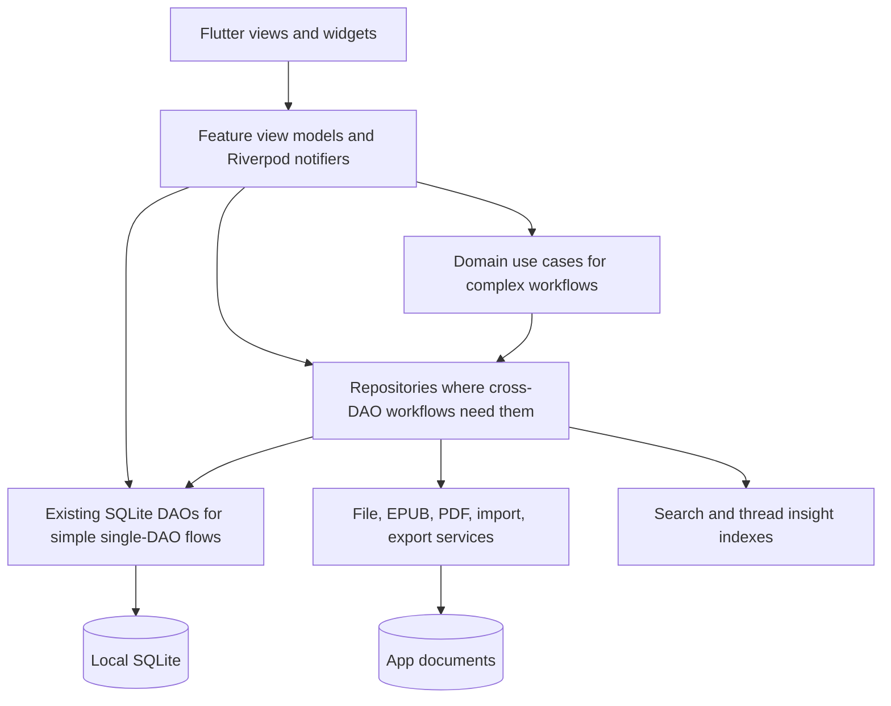
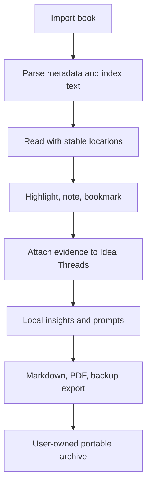
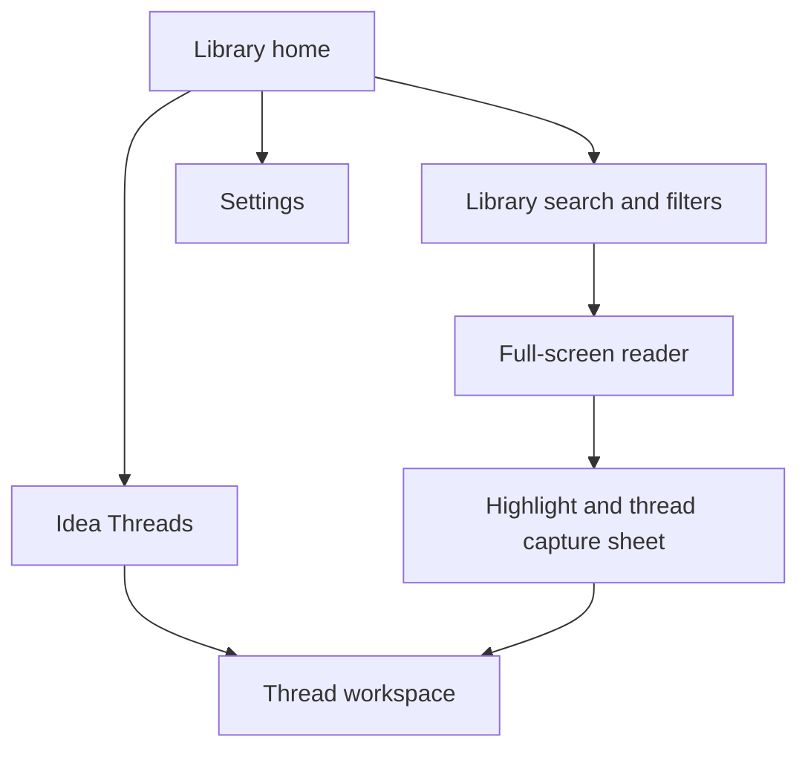
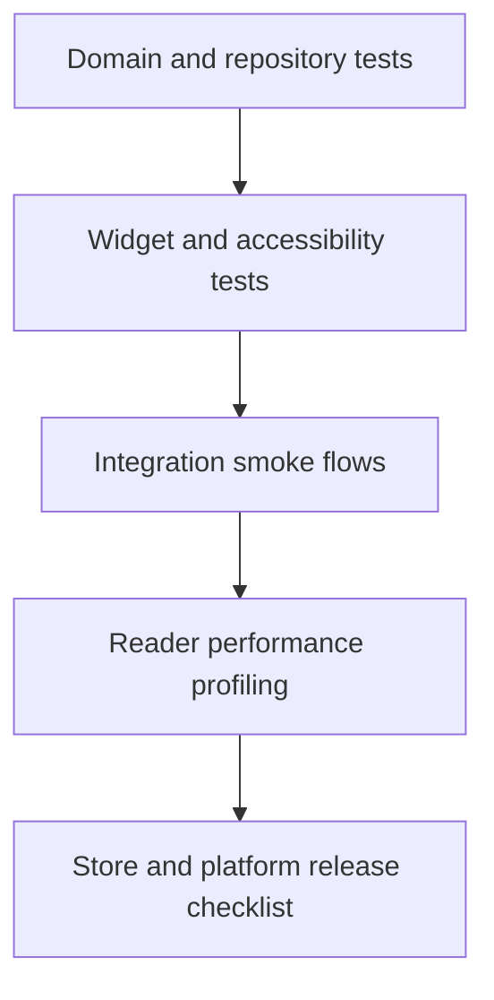

# feat: Build Textara into a premium offline reader platform

## Summary

Build Textara from a capable offline EPUB/PDF reader into a production-grade reader with a signature private knowledge workflow. The first release slice hardens the offline reader, import/search/backup, annotation, accessibility, and CI; Idea Threads and thread-scoped intelligence layer on after that baseline is shippable.

---

## Problem Frame

Textara already has the right foundation for a premium reader: local imports, SQLite persistence, EPUB/PDF rendering, themes, accessibility modes, annotations, backups, and early Idea Threads. The gap is not raw feature count. The app needs stronger architectural boundaries, a reliable reader core, richer annotation workflows, and a distinctive user-visible reason to choose it over generic readers.

The product should compete on ownership, reading comfort, trust, and knowledge capture. Social feeds, ads, mandatory accounts, and network-first AI are out of character for the confirmed scope.

---

## Requirements

**Architecture and reliability**

- R1. The app has explicit repository and view-model boundaries so presentation code no longer coordinates DAOs, file services, and domain logic directly.
- R2. Database migrations preserve existing user libraries, annotations, collections, Idea Threads, and backups across app upgrades.
- R3. Import, parsing, indexing, reading progress, restore, and export flows produce recoverable user-facing errors instead of silent partial failure.
- R4. Long-running work reports progress, supports cancellation where practical, and avoids blocking the reader or library UI.
- R5. EPUB, PDF, backup, and export files are treated as untrusted inputs or outputs with size limits, path confinement, sanitization, cleanup, and explicit user confirmation at trust boundaries.

**Reader experience**

- R6. EPUB and PDF readers restore position accurately, update progress predictably, and avoid excessive writes during rapid navigation.
- R7. EPUB rendering supports a reader-quality text model with stable chapter locations, selectable passages, annotation anchors, typography settings, and responsive layouts.
- R8. Library search combines metadata, tags, and indexed book text with result ranking that helps users find a passage or book quickly.

**Differentiation**

- R9. Idea Threads become a first-class knowledge workflow where users collect passages, add reflections, organize evidence, and export source-linked syntheses.
- R10. The app adds opt-in, thread-scoped reading intelligence that works locally and helps users understand themes, questions, and unfinished ideas without requiring an account.
- R11. The app supports release-grade personalization and accessibility across typography, focus, contrast, motion, and low-stimulation reading without fragmenting the core UI.

**Quality and release readiness**

- R12. Core domain, repository, database, provider, widget, accessibility, and integration flows have tests that make regressions visible.
- R13. The release pipeline checks analysis, formatting, tests, integration smoke paths, platform configuration, privacy posture, and store readiness.

---

## Key Technical Decisions

- KTD1. Evolve the existing stack instead of rewriting it: Riverpod, SQLite, local files, `pdfrx`, and Flutter-native EPUB UI remain the base because the app already has coherent layers and an offline identity.
- KTD2. Add view models first and repository interfaces only where they earn their keep: Flutter's current architecture guidance puts data logic in view models and repositories, while this repo already has injectable DAOs and services that should not be wrapped speculatively.
- KTD3. Use a domain-level reader model for EPUB locations and annotations: chapter indexes alone are too coarse for highlights, resumes, and thread evidence, so the app needs stable local anchors even before it supports complex EPUB layout fidelity.
- KTD4. Treat Idea Threads as the signature market feature: they compound the app's existing annotation and export surfaces into a distinct private research workflow without adding social or cloud dependency.
- KTD5. Keep intelligence local and opt-in: first-pass suggestions live inside Idea Threads, every suggestion explains why it appeared, and a standalone insights screen is deferred until product demand is proven.
- KTD6. Make accessibility a release gate, not a settings page: existing modes are valuable, but they need semantics, contrast, text-scale, target-size, and screen-reader tests to reach premium quality.
- KTD7. Prefer observable quality budgets over subjective polish: reader frames, import latency, search response, restore accuracy, and export integrity should be measurable during implementation and release checks.
- KTD8. Split release readiness into an early spine and final store gate: CI and smoke coverage must guard migration, import, reader, and annotation work before the optional intelligence layer lands.
- KTD9. Scope platform release to Android and iOS first: macOS scaffolding remains compile-aware follow-up work unless the release strategy changes.

---

## High-Level Technical Design

### Layered Application Shape

The view layer should render state and dispatch commands. Repositories own persistence and error mapping. Use cases are only added for workflows that combine several repositories, such as import indexing, Idea Thread evidence management, and backup restore.

### Offline Knowledge Loop

This loop is the market distinction: every feature returns value to private, portable, local reading knowledge rather than to an account system.

### Navigation Model

The phone navigation keeps Library as the default home, exposes Idea Threads as a primary destination, and keeps Settings secondary. Reader remains full-screen. Local intelligence appears inside Thread workspaces and capture flows, not as a top-level destination in the first release slice.

### Quality Gates

The release bar should match the product promise. Offline ownership requires data integrity tests; premium reading requires performance and accessibility gates.

---

## Scope Boundaries

### In Scope

- Production-grade architecture for the current Flutter app.
- EPUB/PDF reader reliability, import/search/export quality, and backup safety.
- First-class Idea Threads and local reading intelligence as differentiators.
- Accessibility, performance, testing, CI, release readiness, and store-quality documentation.
- Android and iOS release readiness.

### Deferred to Follow-Up Work

- Optional cloud sync, account identity, subscriptions, and cross-device state.
- Network AI, server-side recommendations, Readwise/Notion integrations, and third-party export APIs.
- Standalone insights dashboard or top-level analytics screen.
- macOS release support beyond keeping the scaffold compile-aware during implementation.
- DRM support and proprietary bookstore integrations.
- Collaborative reading, public profiles, comments, or social feeds.

---

## System-Wide Impact

This plan touches the app's main product loop: import, library discovery, reader state, annotation capture, Idea Threads, export, backup, and settings. It also changes how future features are built by inserting repositories and feature view models as the default boundary.

The biggest cross-cutting risk is persistent data shape. Database migrations, backup import/export, full-text indexes, and thread evidence links must evolve together so user-owned data remains portable and recoverable.

---

## Phased Delivery

- **Milestone 1: Release spine and reader baseline.** Complete U1, U2, U3, U4, and U8 so import, persistence, search, reading, annotation creation, backup, and CI are guarded before larger differentiators land.
- **Milestone 2: Private knowledge loop.** Complete U5 and U7 so Idea Threads, source-linked exports, and accessibility gates are shippable as the app's signature workflow.
- **Milestone 3: Thread-scoped intelligence and final store gate.** Complete U6 and U9 after the baseline validates that Idea Threads are the right launch wedge.

---

## Interaction State Contracts

- **Import:** idle, picker-cancelled, validating, copying, parsing, indexing, partial success, failed-with-cleanup, complete.
- **Search:** empty query, metadata results, full-text results with book/chapter/excerpt/rank, no results, index unavailable with metadata fallback.
- **Reader:** loading, ready, selecting text, editing annotation, saving progress, changing settings, recoverable missing-file or parse error, empty readable content.
- **Thread capture:** choose existing thread, create new thread, optional reflection, duplicate evidence, saved with undo, failed save with retry, cancelled.
- **Exports and backups:** preview scope, destination confirmation, writing, complete, failed-with-retry, sensitive-data warning.
- **Thread insights:** opt-in prompt, generating locally, no signal yet, suggestion shown with explanation, accepted into thread, dismissed, disabled.

---

## Implementation Units

### U1. Establish Production Architecture Boundaries

- **Goal:** Selectively introduce repository boundaries and feature view models so changed UI code renders state and calls commands instead of coordinating storage directly.
- **Requirements:** R1, R3, R12
- **Dependencies:** None
- **Files:** `lib/domain/repositories/library_repository.dart`, `lib/data/repositories/sqlite_library_repository.dart`, `lib/presentation/providers/app_providers.dart`, `lib/presentation/view_models/library_view_model.dart`, `lib/presentation/view_models/reader_view_model.dart`, `test/unit/repositories/library_repository_test.dart`, `test/unit/view_models/library_view_model_test.dart`, `test/unit/view_models/reader_view_model_test.dart`
- **Approach:** Keep existing DAOs injectable for simple single-DAO flows. Add view models around changed screens and add repository interfaces only for library/search and reader workflows where tests need fakes or behavior crosses DAOs, files, and indexes.
- **Execution note:** Add characterization tests around existing provider behavior before moving logic behind repositories.
- **Patterns to follow:** `lib/data/database/book_dao.dart`, `lib/data/database/annotation_dao.dart`, `lib/data/database/idea_thread_dao.dart`, `lib/presentation/providers/app_providers.dart`
- **Test scenarios:**
  - Happy path: a fake book repository returns books and the library view model exposes sorted, filtered state for title, author, tag, and progress sorting.
  - Edge case: an empty repository returns an empty state without throwing and preserves the current view mode and sort preference.
  - Error path: a repository or DAO failure becomes a typed UI state with retry metadata instead of an uncaught exception.
  - Integration: toggling favourite through the view model updates the repository and refreshes the filtered list without rebuilding unrelated settings providers.
- **Verification:** Changed widgets call view-model commands, simple DAO access is not wrapped without need, and view-model tests cover moved logic.

### U2. Harden Persistence, Migrations, Search, and Backups

- **Goal:** Make SQLite schema evolution, backup import/export, and search indexes safe enough for real user libraries.
- **Requirements:** R2, R3, R5, R8, R12, R13
- **Dependencies:** None
- **Files:** `lib/data/database/database_helper.dart`, `lib/data/database/book_dao.dart`, `lib/data/database/annotation_dao.dart`, `lib/data/database/idea_thread_dao.dart`, `lib/domain/entities/backup_data.dart`, `lib/domain/entities/search_result.dart`, `lib/data/services/export_service.dart`, `lib/data/services/import_security_policy.dart`, `test/unit/database/database_migration_test.dart`, `test/unit/database/book_dao_search_test.dart`, `test/unit/services/backup_round_trip_test.dart`, `test/unit/services/import_security_policy_test.dart`
- **Approach:** Add explicit migrations for new schema versions, transaction-backed backup restore, duplicate-safe restore behavior, hostile-file validation, and a full-text search contract. Replace comma-joined tags and collection IDs only if the migration can preserve existing data.
- **Technical design:** Directional schema additions should separate user-visible entities from derived indexes: books, annotations, collections, threads, thread evidence, normalized tags, and rebuildable full-text content. Search returns book, chapter, excerpt, and rank through a domain result model; SQLite FTS is preferred when available, with deterministic `LIKE` fallback if platform constraints appear during implementation.
- **Patterns to follow:** `DatabaseHelper._onUpgrade`, `BackupData.toJson`, `ExportService.importBackup`
- **Test scenarios:**
  - Happy path: a version 2 database upgrades to the new schema and preserves books, highlights, bookmarks, collections, and thread evidence.
  - Edge case: a fresh latest-version database and an upgraded version 2 fixture have equivalent tables, indexes, and backup round-trip behavior.
  - Edge case: restoring a backup with an existing book ID does not duplicate rows or orphan thread evidence.
  - Error path: an invalid backup fails before partial writes and returns a recoverable result.
  - Error path: a backup containing out-of-app file paths, oversized payloads, or malformed relationship data is rejected before writes.
  - Integration: importing an EPUB indexes chapter text, and searching a phrase returns the owning book with useful ranking metadata.
- **Verification:** Migrations are deterministic, backup round trips preserve entity counts and relationships, and search behavior is covered by DAO-level tests.

### U3. Build a Reliable Import and Indexing Pipeline

- **Goal:** Turn import into a robust workflow for multiple files, metadata extraction, duplicate detection, indexing, progress, and recovery.
- **Requirements:** R3, R4, R5, R8, R12
- **Dependencies:** U1, U2
- **Files:** `lib/domain/entities/import_job.dart`, `lib/domain/use_cases/import_books_use_case.dart`, `lib/data/services/import_service.dart`, `lib/data/services/epub_parser_service.dart`, `lib/data/services/file_storage_service.dart`, `lib/data/services/import_security_policy.dart`, `lib/presentation/view_models/import_view_model.dart`, `lib/presentation/screens/library/library_screen.dart`, `test/unit/use_cases/import_books_use_case_test.dart`, `test/unit/services/import_service_test.dart`, `test/unit/services/import_security_policy_test.dart`, `test/widget/import_progress_test.dart`
- **Approach:** Model import as a job with per-file states. Validate signatures, extensions, size limits, archive paths, and parser boundaries before copying into the library. Copy files, parse metadata, save covers, index text, and persist the book in stages so failures can explain which step failed and clean up temporary artifacts.
- **Patterns to follow:** `ImportService.importFile`, `ImportProgressNotifier`, `FileStorageService`
- **Test scenarios:**
  - Happy path: importing one EPUB copies the file, extracts metadata, saves cover data when available, indexes chapters, and inserts one book.
  - Edge case: importing a PDF with no metadata uses a safe title from the file name and does not attempt EPUB indexing.
  - Error path: a missing file returns a failed result with no database insert and no stale copied file.
  - Error path: a malformed EPUB, archive traversal attempt, oversized PDF, or spoofed extension is rejected with cleanup and no index entries.
  - Integration: importing three files reports per-file progress and leaves successful books available even when one unsupported file fails.
- **Verification:** The library shows accurate import progress and user-facing results, and failed imports do not corrupt the library.

### U4. Upgrade the Reader Core for Fidelity and Performance

- **Goal:** Improve EPUB/PDF reading quality with stable location tracking, throttled persistence, responsive layouts, annotation creation, annotation anchors, and performance budgets.
- **Requirements:** R6, R7, R11, R12
- **Dependencies:** U1, U2
- **Files:** `lib/domain/entities/reader_location.dart`, `lib/domain/entities/epub_content.dart`, `lib/domain/use_cases/create_annotation_use_case.dart`, `lib/presentation/view_models/reader_view_model.dart`, `lib/presentation/screens/reader/reader_screen.dart`, `lib/presentation/screens/reader/epub_reader_view.dart`, `lib/presentation/screens/reader/pdf_reader_view.dart`, `lib/presentation/widgets/reader/annotation_editor_sheet.dart`, `lib/presentation/widgets/reader/reader_app_bar.dart`, `lib/presentation/widgets/reader/reader_bottom_bar.dart`, `test/unit/use_cases/create_annotation_use_case_test.dart`, `test/unit/view_models/reader_progress_test.dart`, `test/widget/reader_screen_test.dart`, `test/widget/epub_reader_view_test.dart`, `test/widget/pdf_reader_view_test.dart`
- **Approach:** Represent reader position as a domain entity that can map to EPUB chapter anchors and PDF page numbers. Define highlight creation for EPUB and PDF selection separately, including source text, anchor fields, note/color editing, save failures, and thread handoff. Throttle progress writes, preserve location on setting changes, and cache parsed chapter text so navigation does not repeatedly parse the same file.
- **Technical design:** Directional states are loading, ready, changing settings, saving progress, recoverable error, and empty content. The view renders these states and delegates commands to the reader view model.
- **Patterns to follow:** `EpubReaderView._loadEpub`, `PdfReaderView.onViewerReady`, `ReaderSettings`
- **Test scenarios:**
  - Happy path: opening an EPUB restores the saved chapter location and reports progress with the current chapter title.
  - Happy path: opening a PDF restores a saved page and reports total page count after the viewer is ready.
  - Edge case: changing font size or margins preserves the nearest stable EPUB location instead of resetting to the first chapter.
  - Error path: a missing book file shows a recoverable reader error and does not write bogus progress.
  - Error path: saving a highlight fails with a retryable editor state and does not create a partial thread link.
  - Performance scenario: rapid page changes coalesce progress writes so the DAO is not called for every transient page event.
- **Verification:** Reader progress is accurate across reopen, settings changes, and rapid navigation; highlight creation works for supported selection sources; reader widgets stay responsive with large books.

### U5. Make Idea Threads the Signature Knowledge Workflow

- **Goal:** Promote Idea Threads from a side screen into a source-linked research workspace for collecting evidence, adding reflections, synthesizing ideas, and exporting portable work.
- **Requirements:** R5, R9, R12
- **Dependencies:** U1, U2, U4
- **Files:** `lib/domain/entities/idea_thread.dart`, `lib/domain/use_cases/thread_evidence_use_case.dart`, `lib/data/database/idea_thread_dao.dart`, `lib/presentation/view_models/idea_threads_view_model.dart`, `lib/presentation/screens/threads/idea_threads_screen.dart`, `lib/presentation/widgets/reader/annotations_sheet.dart`, `lib/data/services/export_service.dart`, `test/unit/use_cases/thread_evidence_use_case_test.dart`, `test/unit/database/idea_thread_dao_test.dart`, `test/widget/idea_threads_screen_test.dart`, `test/widget/thread_evidence_flow_test.dart`
- **Approach:** Add a reader-to-thread capture flow with choose-thread, create-thread, optional reflection, duplicate evidence, saved-with-undo, failed-save, and cancelled states. Add reflection editing per evidence item, evidence reordering, thread filtering, scoped export previews, and source-linked exports. Preserve the existing thread tables and extend them through migrations rather than replacing them.
- **Patterns to follow:** `IdeaThreadDao.addHighlightToThread`, `IdeaThreadDetailScreen`, `ExportService.exportThreadToMarkdown`
- **Test scenarios:**
  - Happy path: a highlight can be added to a selected thread with a reflection and appears in the thread evidence list with the book title.
  - Edge case: adding the same highlight twice does not duplicate evidence and keeps the original sort order.
  - Error path: deleting a thread removes links but keeps the original highlights.
  - Error path: a thread export previews included data, sanitizes Markdown/PDF fields, and excludes unrelated books or settings.
  - Integration: exporting a thread includes title, description, synthesis, evidence, reading notes, thread reflections, and source book names.
- **Verification:** Users can move from reading to evidence capture to synthesis without leaving the offline knowledge loop.

### U6. Add Thread-Scoped Local Reading Intelligence

- **Goal:** Add opt-in intelligence features inside Idea Threads that use local metadata, highlights, reading progress, and indexed text while preserving privacy.
- **Requirements:** R5, R9, R10, R12
- **Dependencies:** U2, U5
- **Files:** `lib/domain/entities/reading_insight.dart`, `lib/domain/entities/reading_question.dart`, `lib/domain/use_cases/generate_thread_insights_use_case.dart`, `lib/data/repositories/local_insight_repository.dart`, `lib/presentation/view_models/thread_insights_view_model.dart`, `lib/presentation/widgets/threads/thread_suggestion_card.dart`, `test/unit/use_cases/generate_thread_insights_use_case_test.dart`, `test/unit/repositories/local_insight_repository_test.dart`, `test/widget/thread_suggestion_card_test.dart`
- **Approach:** Generate local, explainable suggestions inside thread workspaces: recurring highlighted terms, books with unresolved notes, threads that need evidence, and suggested questions from the user's own highlights. Avoid opaque claims; every insight should show why it appeared, allow dismissal, and support disabling.
- **Technical design:** Directional insight inputs are library metadata, annotations, thread evidence, and indexed text snippets. Outputs are cards with explanation, source links, dismissal state, and optional thread creation.
- **Patterns to follow:** `BookDao.fullTextSearch`, `IdeaThreadDao.getEvidenceForThread`, `ExportService.exportThreadToMarkdown`
- **Test scenarios:**
  - Happy path: highlights sharing recurring terms generate a source-linked insight that points to the originating books.
  - Edge case: a small library with no highlights shows thread starter prompts rather than empty analytics.
  - Error path: a corrupted or missing search index skips text-derived insights and still returns metadata-derived insights.
  - Integration: accepting an insight can create a new Idea Thread with proposed title and source evidence.
- **Verification:** Suggestions are opt-in, explainable, local, dismissible, and useful without network access, account identity, or a standalone analytics surface.

### U7. Build Premium Accessibility and Personalization Gates

- **Goal:** Make accessibility and personalization measurable across library, reader, settings, annotations, threads, and insights.
- **Requirements:** R7, R11, R12, R13
- **Dependencies:** U1, U4, U5
- **Files:** `lib/core/theme/leaf_theme.dart`, `lib/domain/entities/reader_settings.dart`, `lib/presentation/screens/settings/settings_screen.dart`, `lib/presentation/widgets/reader/reader_settings_sheet.dart`, `lib/presentation/widgets/library/book_grid_tile.dart`, `lib/presentation/widgets/library/book_list_tile.dart`, `test/a11y/accessibility_guidelines_test.dart`, `test/widget/reader_settings_sheet_test.dart`, `test/widget/settings_screen_test.dart`, `test/golden/theme_contrast_golden_test.dart`
- **Approach:** Add semantics labels where icon-only controls carry meaning, ensure touch targets meet platform expectations, verify text contrast for built-in themes, and test high text-scale layouts. Keep personalization organized around reading comfort rather than adding scattered toggles.
- **Patterns to follow:** `LeafTheme.fromAppTheme`, `BuiltInThemes`, `ReaderSettings`, existing widget tests in `test/widget/theme_test.dart`
- **Test scenarios:**
  - Happy path: each core screen passes tap-target, labeled-target, and text-contrast accessibility guidelines.
  - Edge case: reader settings remain usable at large text scale and do not overflow on narrow phones.
  - Edge case: low-stimulation and reduced-motion modes reduce motion and visual intensity without hiding essential controls.
  - Integration: switching theme, dyslexia mode, and font size updates the active reader without losing position.
  - Integration: keyboard focus order, screen-reader labels, and touch targets work across Library, Reader, Threads, Settings, and thread suggestions when U6 is present.
- **Verification:** Accessibility tests fail on missing labels, insufficient contrast, and undersized tappable controls before release.

### U8. Add Early Quality Spine and Reader Release Gate

- **Goal:** Put automated checks and release-smoke coverage in place before the riskiest data and reader changes are treated as done.
- **Requirements:** R5, R12, R13
- **Dependencies:** U1, U2, U3, U4
- **Files:** `.github/workflows/flutter-ci.yml`, `analysis_options.yaml`, `integration_test/app_smoke_test.dart`, `integration_test/import_read_annotate_export_test.dart`, `docs/release/privacy-and-data.md`, `android/app/build.gradle.kts`, `ios/Runner/Info.plist`, `README.md`, `test/widget_test.dart`
- **Approach:** Add CI for analysis and tests, integration smoke coverage for import, read, annotate, backup, restore, and export, and privacy documentation for local data handling. Treat telemetry, crash reporting, and analytics as explicit product decisions before adding any network dependency.
- **Patterns to follow:** Existing `flutter_lints` baseline in `analysis_options.yaml`, existing unit/widget test layout, setup instructions in `README.md`
- **Test scenarios:**
  - Happy path: the integration smoke flow imports a sample book, opens it, changes reader settings, adds an annotation, and exports data.
  - Error path: attempting to open a missing file shows a recoverable UI state and does not crash the app.
  - Integration: backup export followed by restore into a clean app state preserves books, annotations, collections, threads, and settings.
  - Release gate: CI blocks changes that fail analysis, unit tests, widget tests, accessibility tests, or reader baseline integration smoke tests.
- **Verification:** The reader baseline has automated checks and documented privacy behavior before Idea Threads and local intelligence become release blockers.

### U9. Complete Store Readiness for Android and iOS

- **Goal:** Finish store-quality release evidence after the private knowledge workflow is complete.
- **Requirements:** R5, R12, R13
- **Dependencies:** U5, U6, U7, U8
- **Files:** `docs/release/store-readiness.md`, `docs/release/privacy-and-data.md`, `android/app/src/main/AndroidManifest.xml`, `android/app/build.gradle.kts`, `ios/Runner/Info.plist`, `README.md`, `integration_test/thread_knowledge_loop_test.dart`, `test/widget/export_confirmation_test.dart`
- **Approach:** Extend release checks to the Idea Thread loop, export trust boundaries, platform permissions, Android backup configuration, iOS file protection and privacy declarations, dependency network behavior, App Privacy/Data Safety answers, and manual Android/iOS device checks.
- **Patterns to follow:** Existing platform manifests, `README.md` setup and store listing draft, U8 CI structure
- **Test scenarios:**
  - Happy path: a user imports a sample book, highlights a passage, attaches it to a thread, accepts a local suggestion, previews export scope, and exports a source-linked thread.
  - Error path: export cancellation, write failure, and destination denial leave private data unchanged and show retryable user states.
  - Security scenario: Android permissions, iOS privacy declarations, backup behavior, and dependency network posture match `docs/release/privacy-and-data.md`.
  - Release gate: Android and iOS release candidates pass store-readiness checks without relying on macOS release support.
- **Verification:** Android and iOS store submissions have repeatable test evidence, accurate privacy claims, and no unexplained network or data-collection behavior.

---

## Acceptance Examples

- AE1. Given a user imports a DRM-free EPUB, when the import completes, then the library shows the book, metadata is populated where available, text search can find indexed passages, and the user sees any per-file failures.
- AE2. Given a user leaves a book halfway through a chapter, when they reopen the book after changing typography, then Textara restores the nearest stable reading location.
- AE3. Given a user highlights a passage, when they add it to an Idea Thread with a reflection, then the thread shows the passage, book source, reflection, and export includes all evidence.
- AE4. Given a user uses large text, high contrast, or dyslexia mode, when they navigate library, reader, settings, and threads, then controls remain labeled, reachable, and visually legible.
- AE5. Given a release branch is prepared, when CI runs, then analysis, tests, accessibility checks, integration smoke flows, and release documentation checks pass before store submission.
- AE6. Given a malicious or malformed EPUB, PDF, or backup file, when the user attempts import or restore, then Textara rejects it, explains the failure, cleans temporary artifacts, and writes no partial library state.
- AE7. Given a user exports a thread or backup, when the export begins, then Textara previews included private data and requires an explicit destination confirmation.

---

## Risks & Dependencies

- **Reader fidelity risk:** Flutter-native EPUB text extraction can lose complex layout semantics. Mitigation: target prose-heavy quality first, preserve original HTML metadata for future layout improvements, and document unsupported complex EPUB cases.
- **Data migration risk:** Normalizing tags, indexes, or thread evidence can damage user libraries if migrations are not transactional. Mitigation: migration tests must start from realistic version 2 fixtures and backup restore must be all-or-nothing.
- **Fresh-install drift risk:** `_onCreate` and `_onUpgrade` can produce different schemas. Mitigation: schema parity tests compare fresh latest databases with upgraded fixtures.
- **Hostile file risk:** EPUB, PDF, backup, and export content can abuse parser, archive, path, or resource boundaries. Mitigation: validate signatures and paths, enforce limits, sanitize metadata/HTML/export fields, and test malicious fixtures.
- **Local disclosure risk:** Offline data can still leak through device backup, shared-device access, plaintext exports, or platform misconfiguration. Mitigation: decide platform file protection, backup behavior, encrypted backup support, deletion semantics, and privacy-label accuracy before release.
- **Performance risk:** Parsing EPUBs and deriving insights can jank the UI on large books. Mitigation: model import/indexing as jobs, cache parsed content, throttle progress writes, and profile reader paths in profile mode.
- **Privacy risk:** Marketable intelligence features can drift into cloud assumptions. Mitigation: first-pass insights are local and explainable; any network AI, telemetry, or sync work needs a separate product decision and privacy plan.
- **Scope risk:** A highest-standard app can expand indefinitely. Mitigation: ship the offline reader and Idea Threads loop first, then evaluate sync, subscriptions, or integrations after quality gates are stable.

---

## Documentation / Operational Notes

- Update `README.md` so architecture matches implementation after repositories and view models exist.
- Add `docs/release/privacy-and-data.md` to describe local storage, backups, file permissions, data deletion, encrypted-export stance, and the absence of account/network requirements.
- Add `docs/release/store-readiness.md` with manual checks for import, reading, annotation, export, restore, accessibility, Android, iOS, tablet, platform privacy declarations, and offline mode.
- Keep store copy centered on "Your books, privately understood" or equivalent ownership-oriented positioning.

---

## Sources & Research

- Repo architecture and features: `README.md`, `pubspec.yaml`, `lib/main.dart`, `lib/presentation/providers/app_providers.dart`, `lib/data/database/database_helper.dart`
- Reader and annotation surfaces: `lib/presentation/screens/reader/epub_reader_view.dart`, `lib/presentation/screens/reader/pdf_reader_view.dart`, `lib/domain/entities/annotation.dart`, `lib/domain/entities/idea_thread.dart`
- Existing tests: `test/unit`, `test/widget/library_screen_test.dart`, `test/widget/theme_test.dart`
- Flutter architecture guide: https://docs.flutter.dev/app-architecture/guide
- Flutter performance best practices: https://docs.flutter.dev/perf/best-practices
- Flutter accessibility testing: https://docs.flutter.dev/ui/accessibility/accessibility-testing
- Flutter testing overview and integration testing: https://docs.flutter.dev/testing/overview and https://docs.flutter.dev/testing/integration-tests

---

## Open Questions

- Should metadata editing and cover editing be included before release, or deferred until after import, reader, and thread quality gates are stable?
